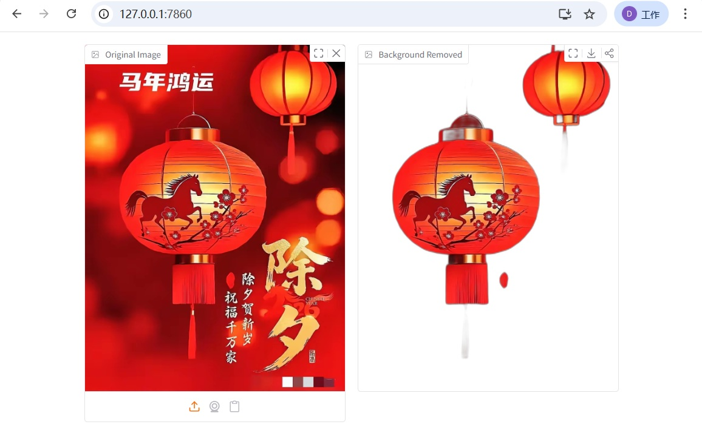

# bg-remover | Instant & Local

[中文文档](README_cn.md)

A minimalist, zero-click background removal tool powered by AI. 100% local processing - your images never leave your device.




## Features

- **Zero-Click Workflow** - Processing triggers automatically on image upload
- **100% Local** - All processing happens on your machine, no cloud uploads
- **Island Mode** - Self-contained Python runtime, clean uninstall by deleting folder
- **Modern UI** - Drag & drop, clipboard paste, webcam capture
- **PNG Export** - Transparent background output with built-in download button

## Quick Start

### Prerequisites

- [uv](https://docs.astral.sh/uv/) - Modern Python package manager

### Installation

```bash
# Clone the repository
git clone https://github.com/AIwork4me/bg_remover.git
cd bg_remover

# Set environment variables (Island Mode)
export UV_PYTHON_INSTALL_DIR="./.python_runtime"
export UV_CACHE_DIR="./.uv_cache"
export UV_PROJECT_ENVIRONMENT="./.venv"

# Install Python 3.12 and create virtual environment
uv python install 3.12
uv venv --python-preference only-managed

# Install dependencies
uv sync

# Run the application
uv run python main.py
```

The browser will open automatically at `http://127.0.0.1:7860`

## Usage

1. Open the web interface
2. Upload an image (drag & drop / paste / webcam)
3. Background is removed **automatically** - no buttons to click
4. Download the result as PNG with transparent background

## Project Structure

```
bg_remover/
├── main.py              # Application entry point
├── pyproject.toml       # Project configuration & dependencies
├── .python-version      # Pinned Python version (3.12)
├── .gitignore
├── README.md            # English documentation
├── README_cn.md         # 中文文档
├── CLAUDE.md            # Development reference
├── remove_bg_result.png # Demo image
├── aiwork4me.jpg        # WeChat QR code
│
├── .python_runtime/     # Local Python (auto-generated)
├── .uv_cache/           # Package cache (auto-generated)
├── .venv/               # Virtual environment (auto-generated)
└── .ai_models/          # AI model storage (auto-generated)
```

## Island Mode

This project uses **Island Mode** - a fully self-contained development environment:

| Component | Location |
|-----------|----------|
| Python Interpreter | `./.python_runtime/` |
| Package Cache | `./.uv_cache/` |
| Virtual Environment | `./.venv/` |
| AI Models (~170MB) | `./.ai_models/` |

**Clean Uninstall**: Delete the project folder. No system-wide changes.

## Technical Stack

| Component | Technology |
|-----------|------------|
| Web Framework | Gradio 6.x |
| AI Model | U2-Net (ONNX) |
| Inference | ONNX Runtime |
| Image Processing | Pillow + rembg |
| Python | 3.12.x (pinned) |

## First Run

On first use, the application downloads the U2-Net model (~170MB). This happens only once.

**Manual Download** (if network issues):
```bash
mkdir -p .ai_models
curl -L -o .ai_models/u2net.onnx \
  https://github.com/danielgatis/rembg/releases/download/v0.0.0/u2net.onnx
```

## Contact & Support

<div align="center">

**WeChat Public Account**


*Scan for more AI tools and tutorials*

</div>

## License

MIT License

## Acknowledgments

- [rembg](https://github.com/danielgatis/rembg) by Daniel Gatis
- [U2-Net](https://github.com/xuebinqin/U-2-Net) by Xuebin Qin
- [Gradio](https://gradio.app/) for the web interface
