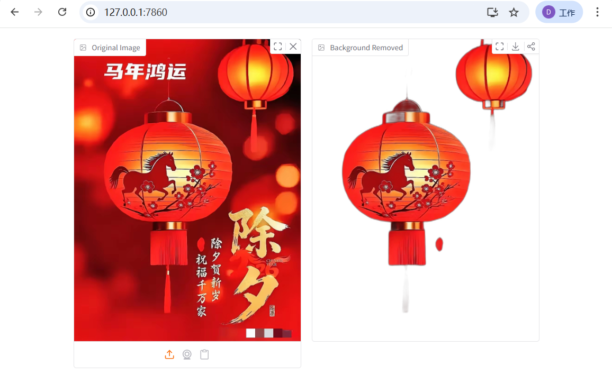

# bg-remover | 即时本地抠图

[English](README.md)

一款极简的零点击AI背景移除工具。100%本地处理 - 图片永远不会离开你的设备。




## 功能特点

- **零点击工作流** - 上传图片即自动处理，无需点击任何按钮
- **100%本地运行** - 所有处理在你的电脑上完成，无需上传云端
- **孤岛模式** - Python运行时完全自包含，删除文件夹即彻底卸载
- **现代界面** - 支持拖拽上传、剪贴板粘贴、摄像头拍摄
- **PNG导出** - 透明背景输出，内置下载按钮

## 快速开始

### 前置要求

- [uv](https://docs.astral.sh/uv/) - 现代Python包管理器

### 安装步骤

```bash
# 克隆仓库
git clone https://github.com/AIwork4me/bg_remover.git
cd bg_remover

# 设置环境变量（孤岛模式）
export UV_PYTHON_INSTALL_DIR="./.python_runtime"
export UV_CACHE_DIR="./.uv_cache"
export UV_PROJECT_ENVIRONMENT="./.venv"

# 安装Python 3.12并创建虚拟环境
uv python install 3.12
uv venv --python-preference only-managed

# 安装依赖
uv sync

# 运行应用
uv run python main.py
```

浏览器会自动打开 `http://127.0.0.1:7860`

## 使用方法

1. 打开网页界面
2. 上传图片（拖拽 / 粘贴 / 摄像头）
3. 背景自动移除 - **无需点击任何按钮**
4. 下载PNG格式结果（透明背景）

## 项目结构

```
bg_remover/
├── main.py              # 应用入口
├── pyproject.toml       # 项目配置与依赖
├── .python-version      # 固定Python版本 (3.12)
├── .gitignore
├── README.md            # 英文文档
├── README_cn.md         # 中文文档
├── CLAUDE.md            # 开发参考
├── remove_bg_result.png # 效果演示图
├── aiwork4me.jpg        # 微信公众号二维码
│
├── .python_runtime/     # 本地Python（自动生成）
├── .uv_cache/           # 包缓存（自动生成）
├── .venv/               # 虚拟环境（自动生成）
└── .ai_models/          # AI模型存储（自动生成）
```

## 孤岛模式

本项目采用**孤岛模式** - 完全自包含的开发环境：

| 组件 | 位置 |
|------|------|
| Python解释器 | `./.python_runtime/` |
| 包缓存 | `./.uv_cache/` |
| 虚拟环境 | `./.venv/` |
| AI模型 (~170MB) | `./.ai_models/` |

**彻底卸载**：直接删除项目文件夹即可，不会残留任何系统级变更。

## 技术栈

| 组件 | 技术 |
|------|------|
| Web框架 | Gradio 6.x |
| AI模型 | U2-Net (ONNX) |
| 推理引擎 | ONNX Runtime |
| 图像处理 | Pillow + rembg |
| Python | 3.12.x (固定版本) |

## 首次运行

首次使用时，程序会自动下载U2-Net模型（约170MB），只需下载一次。

**手动下载**（网络问题时使用）：
```bash
mkdir -p .ai_models
curl -L -o .ai_models/u2net.onnx \
  https://github.com/danielgatis/rembg/releases/download/v0.0.0/u2net.onnx
```

## 联系与支持

<div align="center">

**微信公众号**


*扫码获取更多AI工具和教程*

</div>

## 开源协议

MIT License

## 致谢

- [rembg](https://github.com/danielgatis/rembg) by Daniel Gatis
- [U2-Net](https://github.com/xuebinqin/U-2-Net) by 秦学彬
- [Gradio](https://gradio.app/) 提供Web界面
